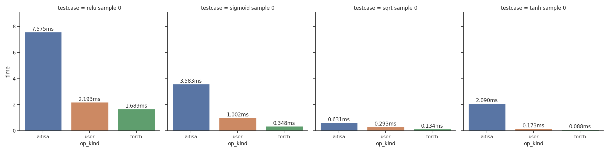

Standard APIs for AI operations

# Environment Requirement

| Dependency | Version required  |
|------------|-------------------|
| CXX        | `17` or higher    |
| CMake      | `3.18` or higher  |
| Gtest      | `1.8.x` or higher |
| Libconfig  | `1.7.3` or higher |
| Libtorch   | latest            |

# Project Layout
Autotest is an operator standard automation testing framework.

- [**`Autotest/auto_test`**](Autotest/auto_test) contains comparative test files.
- [**`Autotest/src`**](Autotest/src) contains data type and kernels for aitisa.
- [**`Autotest/test`**](Autotest/test) contains test files for aitisa kernels.
- [**`Autotest/generate`**](Autotest/generate) contains comparison results.

Here is a comparative test result of the 'activate' operator among the three different operator libraries: Aitisa, Hice, and Torch.


# Quickstart
You can setup *Standard APIs for AI operations* by following instructions:
1. Use **git clone** instruction to download source code

      ```bash
      git https://github.com/JasonChen9/AutoTest.git
      ```

2. Make a new directory **build** under the project directory, then use **cmake** instruction

      ```bash
      mkdir build  
      cd build  
      cmake ..
      ```

3. Use **make** instruction to compile the code

      ```bash
      make
      ```
      
4. Run testing file. Take running convolution operator testing file as an example

      ```bash
      cd bin
      ./conv_test
      ```

5. Run hice_aitisa_test file to compare hice with aitisa.

     ```bash
      cd bin
      ./hice_aitisa_test
      ```

If you want compare with pytorch, you should switch AITISA_API_PYTORCH ON in [**`CMakeList.txt`**](./CMakeList.txt)
```bash
    option(AITISA_API_PYTORCH "test with pytorch" ON)
```


Due to the dependency on hice, we are providing installation instructions for both MKL and DNNL libraries:


### MKL

https://www.intel.com/content/www/us/en/develop/documentation/installation-guide-for-intel-oneapi-toolkits-linux/top/installation/install-using-package-managers/apt.html

According to https://github.com/flashlight/flashlight/issues/640. One might meet MKL library not found issue. We can use the method below:

   ```bash
      cd /tmp && wget https://apt.repos.intel.com/intel-gpg-keys/GPG-PUB-KEY-INTEL-SW-PRODUCTS-2019.PUB && \
      apt-key add GPG-PUB-KEY-INTEL-SW-PRODUCTS-2019.PUB && \
      sh -c 'echo deb https://apt.repos.intel.com/mkl all main > /etc/apt/sources.list.d/intel-mkl.list' && \
      apt-get update && \
      apt install intel-mkl-64bit-2020.4-912
   ```

### dnnl
https://www.intel.com/content/www/us/en/develop/documentation/installation-guide-for-intel-oneapi-toolkits-linux/top/installation/install-using-package-managers/apt.html


